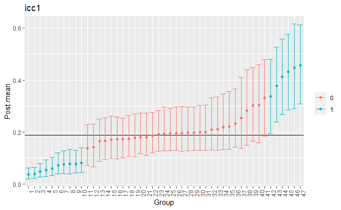

<!-- README.md is generated from README.Rmd. Please edit that file -->


# vICC: Varying Intraclass Correlation Coefficients

[](https://travis-ci.org/donaldRwilliams/BGGM)

The goal of vICC is to compute varying intraclass correlation
coefficients (ICC) in a one-way random effects model (i.e., a random
intercepts only model). Often computing an ICC is the first step when
fitting a mixed-effects (a.k.a., hierarchical, multilevel, etc.) model
that results in *merely* one value that is assumed to apply to each
group (e.g., person, school, etc.). The underlying assumption is a
common within-group variance, whereas, in **vICC**, a random-effects
model is fitted to the residual variance, thereby permitting group-level
ICCs. When subjects are the grouping variable, this is akin to
investigating individual differences in the ICC.

## Measurement Reliability

The methodology in **vICC** was introduced in Williams, Martin, and Rast
(2019). The context was measurement reliability in a cognitive task. To
this end, **vICC** provides ICC(1), that is the correlation for any two
observations from the same group, and ICC(2), that is average score
reliability. Both ICC(1) and ICC(2) are reliability indices. Group-level
standard error of measurement is also provided.

## Installation

<!-- You can install the released version of vICC from [CRAN](https://CRAN.R-project.org) with: -->

<!-- ``` r -->

<!-- install.packages("vICC") -->

<!-- ``` -->

You can install the development version from
[GitHub](https://github.com/) with:

``` r
# install.packages("devtools")
devtools::install_github("donaldRwilliams/vICC")
```

## Available Models

The following are implemented in **vICC**:

1.  `pick_group`:
    
    This model has a spike and slab on the random intercepts for the
    within-group variance. This provides posterior inclusion
    probabilities (PIP) that each group (e.g., person) does not belong
    to the common within-group variance model.

2.  `pick_tau`:
    
    This model has a spike and slab on the random effects standard
    deviation in the scale model which captures between-group
    variability in the within-group variances. This provides a PIP that
    there is variation in the within-group variances. In the context of
    reliability, a large PIP indicates that measurment invariance does
    not hold, given there are group-level differences in so-called
    measurment error.

3.  `pick_none`:
    
    This model also provides group-specific reliability, but there is no
    spike and slab formulation.

4.  `customary`:
    
    This is the standard random intercept model that assumes a common
    within-group variance.

Note that options 1 and 2 provide Bayesian model averaged estimates for
the ICCs.

## Example

This is a basic example which shows you how to implement `pick_group`

    library(vICC)
    library(ggplot2)
    
    # congruent trials
    congruent <- subset(flanker, cond == 0)
    
    
    # subset 25 from each group
    dat <- congruent[unlist(tapply(1:nrow(congruent), 
                                   congruent$id, 
                                   head, 25)), ]
    
    # fit model
    fit <- vicc(
      y  = dat$rt,
      group = dat$id,
      chains = 2,
      iter = 500,
      burnin = 10,
      type =  "pick_group"
    )
    
    fit
    
    #> vICC: Varying Intraclass Correlaton Coefficients
    #> Type: pick_group 
    #> -----
    #> Random Effects:
    #>                 Post.mean Post.sd Cred.lb Cred.ub
    #> RE.sd.mean      0.0464    0.0063  0.0359  0.0615 
    #> RE.sd.sigma     0.5235    0.0742  0.3969  0.6989 
    #> Cor(mean,sigma) 0.7707    0.1330  0.5017  0.9696 
    #> 
    #> Fixed Effects:
    #>          Post.mean Post.sd Cred.lb Cred.ub
    #> FE.mean  0.4425    0.0070  0.4292  0.4557 
    #> FE.sigma 0.0971    0.0047  0.0885  0.1070 
    -----

`RE.sd.sigma` is the between-group standard deviation for the
within-group variances, which is quite large and separated from zero in
these data. Further, `Cor(mean, sigma)` is the correlation between the
group-level means and the standard deviations.

### Posterior Inclusion Probabilities

The posterior inclusion probabilities are obtained with

    pips <- pip(fit)
    pips
    
    Posterior Inclusion Probabilities:
    
    #>  Parameter Group PIP  
    #>  RE_1       1    0.303
    #>  RE_2       2    0.283
    #>  RE_3       3    0.219
    #>  RE_4       4    0.998
    #>  RE_5       5    0.443
    #>  RE_6       6    0.346
    #>  RE_7       7    0.645
    #>  RE_8       8    0.323
    #>  RE_9       9    0.325
    #>  RE_10     10    0.268
    #>  RE_11     11    0.238
    #>  RE_12     12    1.000
    #>  RE_13     13    0.552
    #>  RE_14     14    0.339
    #>  RE_15     15    0.716
    #>  RE_16     16    0.913
    #>  RE_17     17    1.000
    #>  RE_18     18    0.992
    #>  RE_19     19    0.987
    #>  RE_20     20    0.998
    #>  RE_21     21    1.000
    #>  RE_22     22    0.997
    #>  RE_23     23    0.474
    #>  RE_24     24    0.398
    #>  RE_25     25    0.230
    #>  RE_26     26    0.427
    #>  RE_27     27    0.417
    #>  RE_28     28    0.945
    #>  RE_29     29    0.335
    #>  RE_30     30    0.255
    #>  RE_31     31    0.977
    #>  RE_32     32    0.330
    #>  RE_33     33    0.778
    #>  RE_34     34    1.000
    #>  RE_35     35    1.000
    #>  RE_36     36    0.227
    #>  RE_37     37    0.331
    #>  RE_38     38    0.348
    #>  RE_39     39    0.213
    #>  RE_40     40    0.249
    #>  RE_41     41    1.000
    #>  RE_42     42    0.999
    #>  RE_43     43    0.766
    #>  RE_44     44    1.000
    #>  RE_45     45    0.586
    #>  RE_46     46    0.852
    #>  RE_47     47    1.000
    #> 
    #> ------

which provide the probability that each group differs from the fixed
effect within-group variance. The PIPs can then be plotted with

    plot(pips)


## Plotting Group-Level Reliability

The group-level reliability, or ICCs, are plotted with

    plts <- plot(fit)
    
    plts$plot_icc1 + 
      theme(axis.text.x=element_text(angle=90, hjust=1), 
            legend.title = element_blank()) +
      xlab("Group")



Notice that the object `plts` can be further modified with `ggplot2`.
Further, it also includes plots for the means (`plot_mean`), standard
deviations (`plot_sd`), ICC(2) (`plot_icc2`).

### References

<div id="refs" class="references">

<div id="ref-williams2019putting">

Williams, Donald R, Stephen R Martin, and Philippe Rast. 2019. “Putting
the Individual into Reliability: Bayesian Testing of Homogeneous
Within-Person Variance in Hierarchical Models.”

</div>

</div>
