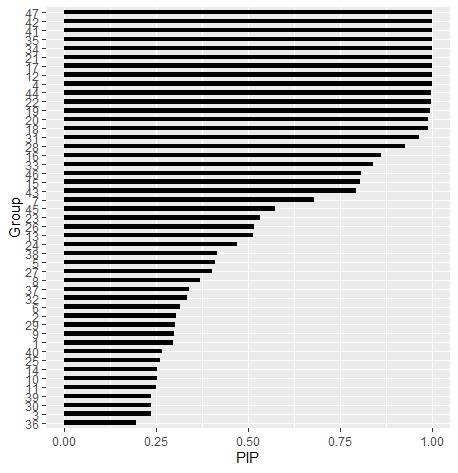
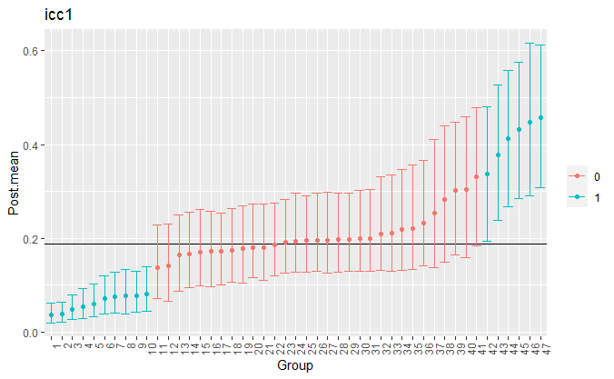

---
# Example from https://joss.readthedocs.io/en/latest/submitting.html
title: 'vICC: Varying Intraclass Correlation Coefficients in R'
tags:
- intraclass correlation coefficients
- mixed-effects model
- spike-and-slab
- random effects
- reliability
authors:
  - name: Donald R. Williams
    affiliation: 1 # (Multiple affiliations must be quoted)
affiliations:
 - name: Department of Psychology, University of California, Davis
   index: 1
citation_author: Williams
date: 08 December 2020
year: 2020
bibliography: inst/REFERENCES.bib
---

# Summary
In mixed-effects (a.k.a, hierarchical or multilevel) models, intraclass
correlation coefficients (ICC) are commonly computed, with applications spanning 
from characterizing group-level homogeneity [@Shieh2016] to measurement reliability [@williams2020fine]. 
While there are a wide spectrum of applications, an underlying assumption of each is that the 
variance components used in their computation are fixed and non-varying. Consider
the case of ICC(1), that is,


\begin{align}
\label{eq:1}
\text{ICC(1)} = \frac{\sigma^2_b}{\sigma^2_b + \sigma^2_w}
\end{align}


where $\sigma^2_b$ is the between-group variance and $\sigma^2_w$ the within-group variance. In
a one-way random effects model, $\sigma^2_w$ is essentially the $average$ within-group variance. 
However, if there are group-level differences in $\sigma^2_w$, this implies that there also
group-level variation in the ICC. 

The methodology in R package **vICC** was specifically designed
to quantify variation in ICC(1) by allowing $\sigma^2_w$ to vary. This can be used to 
indentify groups that are more (or less) homogeneous, as well as which groups are adequately 
described by Equation \eqref{eq:1}. There is no software currently available for
this purpose.


# Statement of Need
The **vICC** package can be used to: 

* Obtain posterior probabilities that each group shares a 
  common within-group variance (i.e., $\sigma^2_w$ in Equation \eqref{eq:1}). This is accomplished
  with a spike-and-slab approach for Bayesian hypothesis testing (X).
  
* Test for between-group differences in $\sigma^2_w$. This is also accomplished with a spike-and-slab     
  formulation (X).

* Compute group-specific ICCs, that is the correlation for any two observations from the same group, and  
  ICC(2), that is average score reliability. Both ICC(1) and ICC(2) are reliability indices.
  
Additionally, there are plotting capabilities using the R package **ggplot2** (X).

# Methodology

The following models are in **vICC**:

1.  `pick_group`:
    
    This model has a spike and slab on the random intercepts for the
    within-group variance. This provides posterior inclusion
    probabilities (PIP) that each group (e.g., person) does not belong
    to the common within-group variance model.

2.  `pick_tau`:
    
    This model has a spike and slab on the random effects standard
    deviation in the scale model which captures between-group
    variability in the within-group variances. This provides a PIP that
    there is variation in the within-group variances. In the context of
    reliability, a large PIP indicates that measurement invariance does
    not hold, given there are group-level differences in so-called
    measurement error.

3.  `pick_none`:
    
    This model also provides group-specific reliability, but there is no
    spike and slab formulation. This is perhaps ideal for those not
    familiar with Bayesian testing, but would still like to compute
    varying ICCs.

4.  `customary`:
    
    This is the standard random intercept model that assumes a common
    within-group variance.

Note that options 1 and 2 provide Bayesian model averaged estimates for
the ICCs. The model formulations are provided in X


## Implementation
The following estimates the `pick_group` model for reaction times from a cognitive task (X).

```
# congruent trials
congruent <- subset(flanker, cond == 0)

# subset 25 from each group
dat <- congruent[unlist(tapply(1:nrow(congruent), 
                               congruent$id, 
                               head, 25)), ]

# fit model
fit <- vicc(
  y  = dat$rt,
  group = dat$id,
  chains = 2,
  iter = 500,
  burnin = 10,
  type =  "pick_group"
)
```

The posterior inclusion probabilities are then plotted with `plot(pip(fit))`.




Figure 1: Posterior inclusion probabilities for each group that provides the evidence 
for differing from the average within-group variance.

The group-level ICCs are plotted with

```
plts <- plot(fit)

plts$plot_icc1 + 
  theme(axis.text.x=element_text(angle=90, hjust=1), 
        legend.title = element_blank()) +
  xlab("Group")
```


Figure 2: Group-level intraclass correlation coefficients.

Notice that the object `plts` can be further modified with **ggplot2**. Further, it also includes 
plots for the means (`plot_mean`), standard deviations(`plot_sd`), ICC(2) (`plot_icc2`).


# Conclusion


# Conclusion
The **vICC** package allows researchers to investigate variability in intraclass correlation coefficients.
In the future, the suite of models will be expanded to allow for partitioning the variance among several
grouping variables.

# Acknowledgements
DRW was supported by a National Science Foundation Graduate Research Fellowship
under Grant No. 1650042


# References

